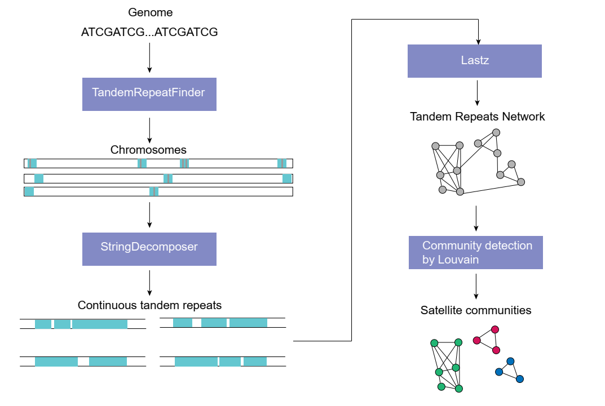

# BSLtool: Build satellite library
This pipline is designed for building satellite library based on TRF method. It includes three steps (TRF results are input). First, BSLtool performed StringDecomposer based on the consensus repeat sequence to remove the noise in each TRF region. Then, using Lastz to build connection between each repeat region. Finally, BSLtool performed community detection method for TR network to build satellite library.

## Dependencies
Python 3.9.16

Packages  | Version used in Research|
--------- | --------|
joblib  | 1.1.0 |
lastz  | 1.04.22 |
samtools  | 1.6 |
networkx  | 2.7.1 |

StringDecomposer (https://github.com/ablab/stringdecomposer) with version 1.1.2.   
Development environment: Linux  
Development tool: Pycharm
## Usage
```Bash
usage: buildSatelliteLibrary.py [-h] -i TRF_RESULT_FILE -g GENOME_REF [-o OUTDIR] [-th THREADS] [-rn FILTER_REPEAT_NUMBER] [-ru FILTER_REPEAT_UNIT_LENGTH] [-f FILTER_IDENTITY]
                                [-fa FILTER_AL] [-m MERGE_INTERVAL] [-or OVERLAP_RATIO]

Building satellite library

optional arguments:
  -h, --help            show this help message and exit
  -i TRF_RESULT_FILE, --trf_result_file TRF_RESULT_FILE
                        TRF result bed, required
  -g GENOME_REF, --genome_ref GENOME_REF
                        genome, required
  -o OUTDIR, --outdir OUTDIR
                        HiCAT reads output path default is ./BSL_out
  -th THREADS, --threads THREADS
                        The number of threads, default is 1
  -rn FILTER_REPEAT_NUMBER, --filter_repeat_number FILTER_REPEAT_NUMBER
                        filter repeat number, default is 100
  -ru FILTER_REPEAT_UNIT_LENGTH, --filter_repeat_unit_length FILTER_REPEAT_UNIT_LENGTH
                        filter repeat unit length, default is 100
  -f FILTER_IDENTITY, --filter_identity FILTER_IDENTITY
                        filter identity, default is 80%
  -fa FILTER_AL, --filter_al FILTER_AL
                        filter alignment length in lastz, default is 80%
  -m MERGE_INTERVAL, --merge_interval MERGE_INTERVAL
                        merge interval for satellite regions, default is 500K
  -or OVERLAP_RATIO, --overlap_ratio OVERLAP_RATIO
                        filter overlap ratio in TRF, default is 0.6

```
Inputs

TRF_RESULT_FILE e.g. TRF.bed (chr start end unit_length consensus with \t separator) 
```Bash
chr1    1       13378   7       1911.1  CCCTGAA
chr1    24573   24924   7       50.4    TGAACCC
chr1    95610   95690   1       81.0    A
chr1    95610   95690   31      2.5     AAAAAAAGAAAAAAAAATAAAAAAAAAAAAA
chr1    95610   95690   34      2.4     AAAAAAAGAAAAAAAAATCAAAAAAAAAAAAAGA
chr1    153388  153426  13      3.0     AGTTCGCGGACTG
chr1    153485  153523  13      3.0     GTTCGCGGACTGG
chr1    159345  159383  13      3.0     GTTCGCGGACTGG
chr1    182684  182709  13      2.0     CCAGTCCGCGAAC
chr1    182769  182807  13      3.0     CAGTCCGCGAACT
chr1    186645  194018  115     64.4    CATCACCCTACGCCTCTGCCAAGCAATAGAGCAAACTGGGAATCACCCCACTTGTCATATTGCTAAGATTTGGATTACATGTTCACGGGTTGGATTGACGGCAGATGAGACTAGG
chr1    199043  199143  33      3.1     AACAAAAGACGGATTCGGCGATCAAGGCTTTGG
chr1    205863  205913  26      2.0     CACCCCTCACAACGATCGGTTCCCTA
chr1    205972  206073  27      3.8     CCCCATACAAGGATCGGTTCCCTTTCA
chr1    205972  206075  53      2.0     CCCCACACAAGGATCGATTCCCTTTCACCCCATACAAGGATCGGTTCCCATCA
...

```
GENOME_REF
```Bash
>chr1
CCCTGAACCCTGAACCCTGAACCCTGAACCCTGAACCCTGAACCCTGAAC
CCTGAACCCTGAACCCTGAACCCTGAACCCTGAACCCTGAACCCTGAACC
CAGAACCCTGAACCCTGAACCCTGAACCCTGAACCCTGAACCCTGAACCC
TGAACCCTGAACCCTGAACCCTGAACCCTGAACCCTGAACCCTGAACCCT
GAACCCTGAACCCTGAACCCTGAACCCTGAACCCTGAACCCTGAACCCTG
AACCCTGAACCCTGAACCCTGAACCCTGAACCCTGAACCCTGAACCCTGA
ACCCTGAACCCTGAACCCTGAACCCTGAACCCTGAACCCTGAACCCTGAA
......
>chr2
CTGAACCCTGAACCCTGAACCCTGAACCCTGAACCCTGAACCCTGAACCC
TGAACCCTGAACCCTGAACCCTGAACCCTGAACCCTGAACCCTGAACCCT
GAACCCTGAACCCTGAACCCTGAACCCTGAACCCTGAACCCTGAACCCTG
AACCCTGAACCCTGAACCCTGAACCCTGAACCCTGAACCCTGAACCCTGA
ACCCTGAACCCTGAACCCTGAACCCTGAACCCTGAACCCTGAACCCTGAA
CCCTGAACCCTGAACCCTGAACCCTGAACCCTGAACCCTGAACCCTGAAC
......
```
Other Parameters(default)
```Bash
Regions with unit length lower than FILTER_REPEAT_UNIT_LENGTH(100) and repeat number lower than FILTER_REPEAT_NUMBER(100) will be removed.
Regions overlap with others larger than OVERLAP_RATIO(0.6) will be removed and saved the region with small unit.
Each region will be denoised by StringDecomposer. The filter identity is FILTER_IDENTITY(80%).
Regions with identity large than FILTER_IDENTITY(80%) and alignment length larger than FILTER_AL(80%) will be considered as same satellite.
BSLtool merged the closed regions with distance smaller than MERGE_INTERVAL(500000)
```

### Output
```Bash
The output is ./BSL_out/satellite
summary_satellite.xls (index default_name chrs repeat_number AT_percentage genomic_size unit_sequence)
*.region.bed:
Final regions for each satellite.
*.mergeregionMERGE_INTERVAL.bed: 
Final regions merged with distance smaller than MERGE_INTERVAL(500000). For visualization or HOR analysis(e.g. HiCAT)
```


## Contact
If you have any questions, please feel free to contact: gaoxian15002970749@163.com, xfyang@xjtu.edu.cn, kaiye@xjtu.edu.cn


